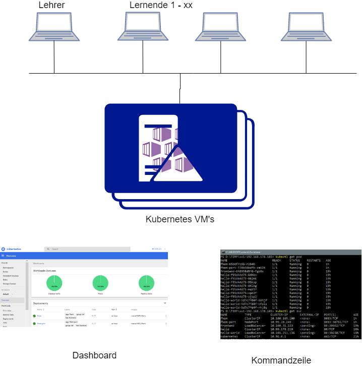

lernkube - Kubernetes Umgebung 
------------------------------

Das Projekt `lernkube` erlaubt es flexible Lernumgebungen für Lehrende und Lernende aufzubauen. Dazu werden Virtuelle Maschinen (VM) mit einer Kubernetes Umgebung verwendet. 

*Kubernetes hat im letzten Jahr eine massive Verbreitung erfahren und wird von der [Cloud Native Computing Foundation (CNCF)](https://www.cncf.io/) unterstützt. Die CNCF dient als herstellerneutrales Zuhause für viele der am schnellsten wachsenden Projekte auf GitHub, einschließlich Kubernetes, Prometheus und Envoy, und fördert die Zusammenarbeit zwischen den führenden Entwicklern, Endbenutzern und Anbietern der Branche.*

Mit einer Kubernetes Umgebung können die Lernenden, nur mit einem Browser, auf eine Vielzahl von Applikationen zugreifen. Dazu greifen sie auf sogenannte [YAML](https://de.wikipedia.org/wiki/YAML)-Dateien zu, welche zum Start der Applikationen dienen. Die YAML Dateien referenzieren wieder [Docker Images](https://hub.docker.com/), welche die eigentlichen Applikationen beinhalten.  

Neben der Lernumgebung stellt `lernkube`, in weiteren Projekten ganze Umgebungen zur Verfügung, z.B.:
* [MySQL Umgebung mit Bereitstellung von Testdaten und Graphischer Oberfläche](https://github.com/mc-b/duk/tree/master/mysql)
* [Interaktives Lernen mit Jupyter/BeakerX](https://github.com/mc-b/duk/tree/master/jupyter) 
* [Beispiele zum Internet der Dinge](https://github.com/mc-b/duk/tree/master/iot)
* [OS Ticket - Helpdesk Applikation](https://github.com/mc-b/duk/tree/master/osticket)
* [Beispiele zu Big Data](https://github.com/mc-b/duk/tree/master/bigdata)
* [DevOps Umgebung für Planung, Continuous Integration und Delivery](https://github.com/mc-b/duk/tree/master/devops)
* [Microservice Beispiele mit REST, Messaging, ESI (Edge Side Include)](https://github.com/mc-b/misegr)
* [Business Process Model and Notation (BPMN, deutsch Geschäftsprozessmodell und -notation)](https://github.com/mc-b/misegr/tree/master/bpmn)

### Quick Start

Dazu wird ein normaler PC mit min. 8 GB RAM und 40 GB freier HD benötigt. Die Installation geht von einem Windows 10 PC aus. Auf Linux/Mac entfällt Git/Bash bzw. wird nur Git benötigt. Statt `kubeXX.bat` kann `. ./kubeenv` verwendet werden. 

Installiert [Git/Bash](https://git-scm.com/downloads), [Vagrant](https://www.vagrantup.com/) und [VirtualBox](https://www.virtualbox.org/).

Startet die Git/Bash Console und Erstellt die Kubernetes VM mittels:

	git clone https://github.com/mc-b/lernkube
	cd lernkube
	vagrant plugin install vagrant-disksize
	vagrant up
	
Öffnet die Interaktive Lernumgebung mittels [http://localhost:32188](http://localhost:32188), wechselt in das Verzeichnis `work` und wählt ein Notebook (ipynp Dateien) an.

Die VM kann mittels `vagrant suspend` angehalten, mittels `vagrant up` wieder gestartet und mittels `vagrant destroy -f` gelöscht werden.

Das Dashboard, von Kubernetes, kann mittels der Datei `dashboard.bat` angezeigt werden. Der Logindialog kann mit `Skip` übersprungen werden.

Nach dem Anklicken von `kubeps.bat` (PowerShell) oder `kubesh.bat` (Git/Bash) können neue Applikationen und Services mittels `kubectl create -f YAML-Datei` erzeugt und deren Oberfläche mittels `startsvc <service>` angewählt werden. Siehe auch Beispiele oben.

[Weave Scope](https://www.weave.works/) ist ein Werkzeug zur grafischen Visualisierung Ihrer Container, Pods, Dienste usw. Die Weave Scope Oberfläche, kann in der Shell, mittels `weave` gestartet werden.

### Installation

Die Installation kann auf einen Windows, Mac- oder Linux Computer erfolgen. Je nach Installationsart, Standalone, Mehrere VM, Cluster etc. ergeben sich andere Anforderungen.

Deshalb sind die nachfolgenden Beschreibungen als Empfehlungen zu sehen.

Alle Installationen basieren auf Änderungen in der [config.yaml](config.yaml) Datei in diesem Verzeichnis. 

* [Lernumgebung auf lokalem PC](#quick-start)
* [Mehrere VM's](#mehrere-vms)
* [Cluster](#cluster)
* [Dedicated-Server für VM's einrichten](#dedicated-server)

**Der Ablauf der Installation lässt sich wie folgt Zusammenfassen:**
* Installation VM mit Linux/Ubuntu 16.x
* Feintuning docker Daemon, Erstellung Server Zertifikat für Remote Zugriff (`.docker`)
* Installation Kubernetes, nur Programme.
* Initialisierung Kubernetes Master, Erstellung Server Zertifikat für Remote Zugriff (`.kube/config`)
* Installation Kubernetes Add-ons wie Dashboard, Weave, Ingress
* Klonen der Repositories laut Eintrag in `config.yaml -> addons: -> git:` und Ausführen von `scripts/install.sh` pro geklontes Repository
* Download Client Programme wie `docker.exe`, `kubectl.exe` und Erstellung der Scriptdateien zum Setzen der Umgebungsvariablen (z.B. `DOCKER_HOST`) und Start PowerShell oder Git/Bash
* Joinen der Worker Nodes
* Aufräumen u.a. Umount /vagrant Verzeichnis aus Sicherheitsgründen

Für Details siehe [Vagrantfile](Vagrantfile) und Verzeichnis [scripts](scripts/).

**Bei Problemen** bei der Installation siehe [FAQ](FAQ.md).

#### Alternativen 

Alternativ kann [Docker for Windows/Mac](https://www.docker.com/products/docker-desktop) oder [Minikube](https://github.com/kubernetes/minikube) verwendet werden. Diese Umgebungen sind aber nicht Cluster fähig und erfordern [Feintuning](docker4windows/).

Oder die gleiche Umgebung wie mit lernkube auf den Cloud Plattformen von Amazon und Microsoft eingerichtet werden.

* [Amazon AWS Cloud](aws/) - hat noch Probleme mit Datenspeicherung und LoadBalancer.
* [Microsoft Azure Cloud](azure/)

#### Mehrere VMs

Es wird pro Lehrende eine VM zur selbstständigen Verfügung eingerichtet. Die VM's werden  Zentral in einem Rechenzentrum betrieben werden, die Lehrenden greifen mittels Windows PC auf die einzelnen VM zu.

**Voraussetzungen**

Genügend GB RAM für alle VM's, z.B. können bei einem 32 GB RAM System ca. 7 VM's à 4 GB RAM eingerichtet werden.

**Konfiguration**

Siehe Datei [multi-master.yaml](templates/multi-master.yaml).

Die wichtigsten Konfigurationen:

	master:
	  count: 5
	...
	use_dhcp: true  

Es werden 5 VM's erzeugt. Die VM beziehen die IP-Adresse automatisch von einem DHCP-Server.

Nach der Installation stehen die Verzeichnisse `master-01` bis `master-05` zur Verfügung. Diese Verzeichnisse sind auf die jeweiligen Client PC zu kopieren. Z.B. Lernender A bekommt `master-01` zugewiesen. Dazu kopiert es das Verzeichnis `master-01` auf seinen PC und startet mittels `kubeps.bat` eine PowerShell und kann dann mittels `kubectl create -f YAML-Datei` weitere Applikationen starten. Analog wie in Quick Start beschrieben. Die Kommunikation lokaler PC mit der VM erfolgt verschlüsselt, die Keys stehen in den Verzeichnissen `.kube` und `.docker`. 

Alternativ können auch fixe IP-Adressen für die VM's verwendet werden. Dazu ist die `config.yaml` wie folgt zu ändern:

	use_dhcp: false
	ip:	
      master:   192.168.178.200 

Konfiguration ohne DHCP und unter `ip: -> master:` steht die Erste IP-Adresse ab wo aufgezählt wird.

#### Cluster

Bei einem Cluster wird ein Kubernetes Master und mehrere Worker erzeugt. Diese Umgebung eignet sich zur Demonstration einer Verteilten Umgebung.

**Voraussetzungen**

Genügend GB RAM für alle VM's, z.B. können bei einem 32 GB RAM System ca. 7 VM's à 4 GB RAM eingerichtet werden.

**Konfiguration**

Siehe Datei [cluster-large.yaml](templates/cluster-large.yaml) oder [cluster-small.yaml](templates/cluster-small.yaml).

Die wichtigsten Konfigurationen:

	master:
	  count: 1
	  cpus: 2
	  memory: 5120
	worker:
	  count: 2

Es wird ein Master und zwei Worker Nodes erstellt. Der Master und die Worker Nodes werden während der Installation automatisch miteinnander gejoint.

	use_dhcp: false  
	ip:
	  master:   192.168.178.200
	  worker:   192.168.178.201
	net:
	  network_type: public_network
	  default_router: "route add default gw 192.168.178.1 enp0s8 && route del default gw 10.0.2.2 enp0s3"	  

Die IP-Adressen werden fix vergeben. Bei fixer IP-Adressen Vergabe, muss ein "Default Router" gesetzt sein, ebenfalls muss ein "Public Network" verwendet werden. Ansonsten finden sich zwar Master und Worker, können aber nicht miteinnander kommunizieren.

#### Dedicated-Server

Es wird ein eigenständiger Server mit Linux eingerichtet. Auf diesem wird anschliessend mehrere VM's oder ein Kubernetes Cluster erstellt.

**Voraussetzungen**

Einen oder mehrere Standard PC mit ca. 32 GB RAM und 256 GB HD.

**Grundinstallation**

Ubuntu 16.x Server installieren.

Weitere Software als `root` mit dem Script `installvv.sh` installieren.

	git clone https://github.com/mc-b/lernkube
	cd lernkube
	sudo bash -x scripts/installvv.sh

Nach der Grundinstallation kann können [mehrere VM's] oder ein [Cluster](#cluster) auf dem Dedicated-Server eingerichtet werden.

**Verwendete Produkte**
* [VirtualBox](https://www.virtualbox.org/) - die Virtualisierungs Umgebung
* [Vagrant](https://www.vagrantup.com/) - Automatisierungs Lösung für VM aus dem Bereich Infrastructure as Code.

**Links**

* [WLAN Access Point aufsetzen](https://wiki.ubuntuusers.de/WLAN_Router/)
* [Configuring VirtualBox autostart on Linux](https://geek1011.github.io/linux-tips/configuring-virtualbox-autostart/)
* [Vagrant Default Network Interface](https://www.vagrantup.com/docs/networking/public_network.html#default-network-interface)

#### Links

* [Using kubeadm to Create a Cluster](https://kubernetes.io/docs/setup/independent/create-cluster-kubeadm/)
* [Kubernetes-powered Docker CE ](https://www.melvinvivas.com/kubernetes-powered-docker-ce/)
* [DashBoard](https://github.com/kubernetes/dashboard)
	
### Tutorials

* [Minikube aufsetzen](https://kubernetes.io/docs/tutorials/stateless-application/hello-minikube/) 
* [Deployment (Bereitstellung) als Service eintragen](https://kubernetes.io/docs/concepts/services-networking/connect-applications-service/)

### Reference

* [kubectl](https://kubernetes.io/docs/reference/kubectl/overview/)
* [kubectl JSONPath Support](https://kubernetes.io/docs/reference/kubectl/jsonpath/)
