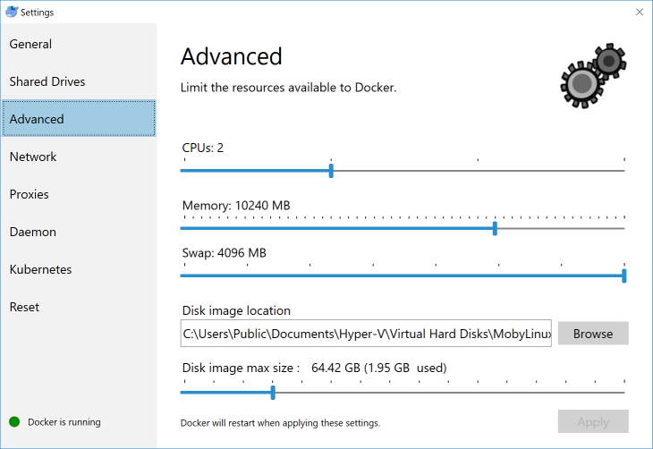
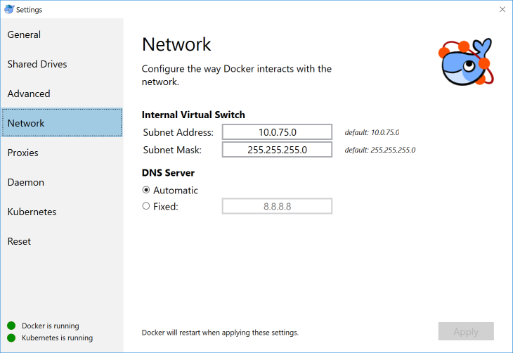
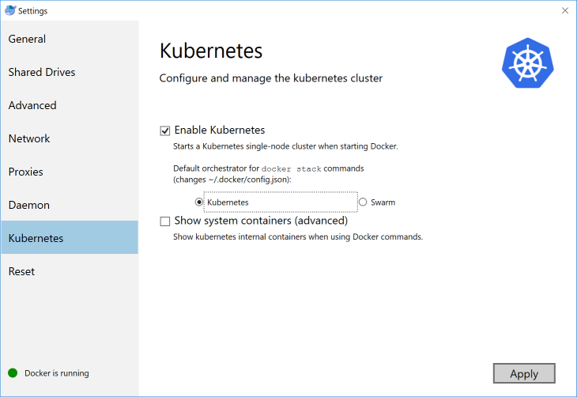

Docker for Windows / Mac
------------------------

### Feintuning

**Shared Drives** aktivieren, Verzeichnis `C:/Users/data` Erstellen und Persistent Volume und Claim in Kubernetes erstellen.

Dem Verzeichnis `C:/Users/data` ist Vollzugriff für `Jeder` freizuschalten.

	kubectl create -f docker4windows/DataVolume.yaml

	
	
Die Pods speichern alle Daten im Verzeichnis `C:/Users/data`. Sollen die Daten woanders gespeichert werden ist der Eintrag `hostPath`in `DataVolume.yaml` anzupassen.

**Memory**, je nach Einsatz anpassen.
* Gogs, Kanboard, Jupyter etc. sollten 4096 MB reichen
* Microservices einen Wert grösser 8192 MB einstellen. 

**Netzwerk**

Netzwerk Subnet Address (LoadBalancer = .1) notieren. Diese wird für Services gebraucht, die auf den LoadBalancer zusteuern.

**Kubernetes** aktivieren

## Pods und Services starten

Die folgenden Arbeiten in der Git/Bash ausführen:

	git clone https://github.com/mc-b/devops
	cd devops/kubernetes

### Dashboard aktivieren (optional)

	kubectl apply -f https://raw.githubusercontent.com/kubernetes/dashboard/v1.10.1/src/deploy/recommended/kubernetes-dashboard.yaml
	kubectl apply -f /vagrant/addons/dashboard-admin.yaml

Der Token für den Logindialog kann wie folgt Abgefragt werden:

	kubectl -n kube-system describe secret  $(kubectl -n kube-system get secret | grep kubernetes-dashboard-token | awk ' { print $1 }' ) | grep token:

Weitere:
* [github Projekt](https://github.com/kubernetes/dashboard)

### Weave Scope aktivieren (optional)

	kubectl apply -f "https://cloud.weave.works/k8s/scope.yaml?k8s-version=$(kubectl version | base64 | tr -d '\n')"
	
Weitere Informationen:
* [Kubernetes Add-ons](../addons)

### Ingress (Reverse Proxy) aktivieren (optional)

	kubectl apply -f https://raw.githubusercontent.com/kubernetes/ingress-nginx/master/deploy/namespace.yaml
	kubectl apply -f https://raw.githubusercontent.com/kubernetes/ingress-nginx/master/deploy/default-backend.yaml
	kubectl apply -f https://raw.githubusercontent.com/kubernetes/ingress-nginx/master/deploy/configmap.yaml 
	kubectl apply -f https://raw.githubusercontent.com/kubernetes/ingress-nginx/master/deploy/tcp-services-configmap.yaml 
	kubectl apply -f https://raw.githubusercontent.com/kubernetes/ingress-nginx/master/deploy/udp-services-configmap.yaml
	kubectl apply -f  https://raw.githubusercontent.com/kubernetes/ingress-nginx/master/deploy/rbac.yaml 
	kubectl apply -f  https://raw.githubusercontent.com/kubernetes/ingress-nginx/master/deploy/with-rbac.yaml 	
	kubectl apply -f  addons/service-nodeport.yaml

### Namespaces für Microservices (optional)

	kubectl create namespace scsesi
	kubectl create namespace ms-kafka
	kubectl create namespace ms-kubernetes
